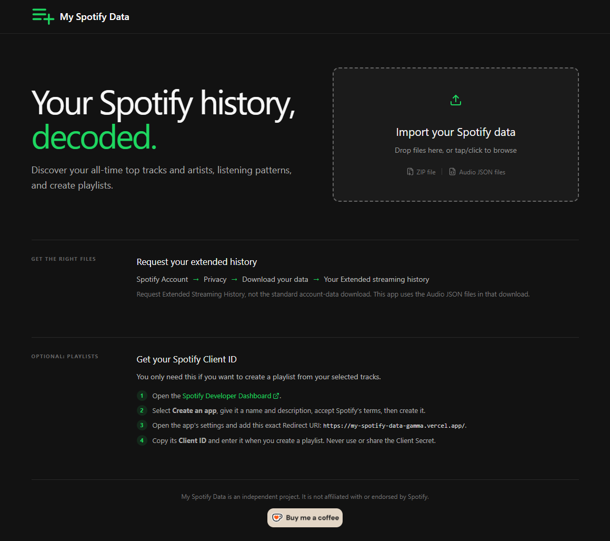
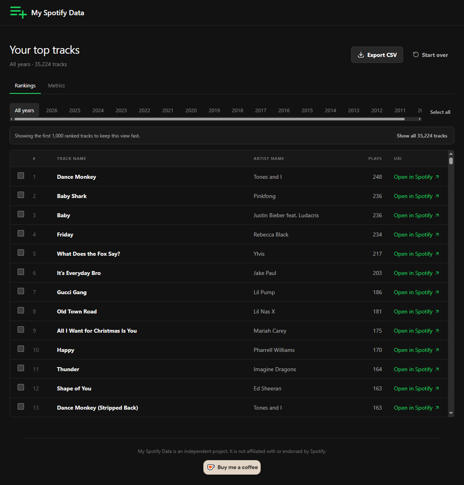
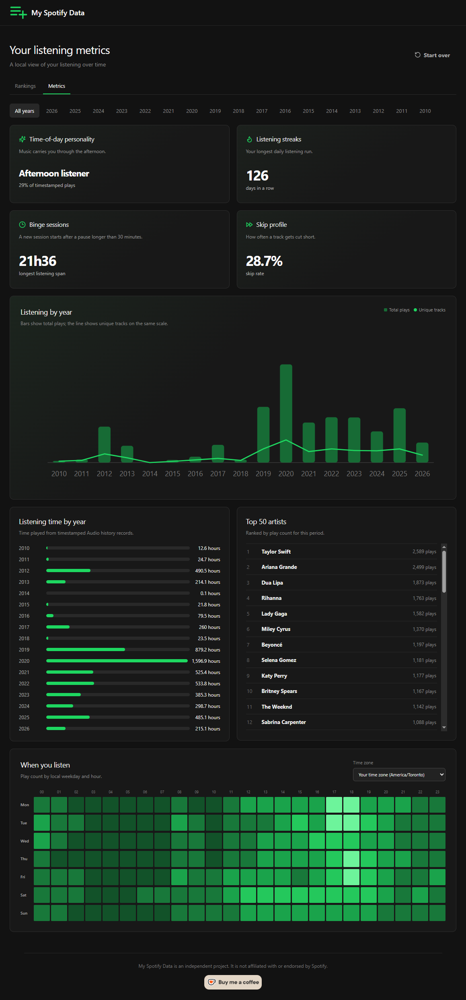
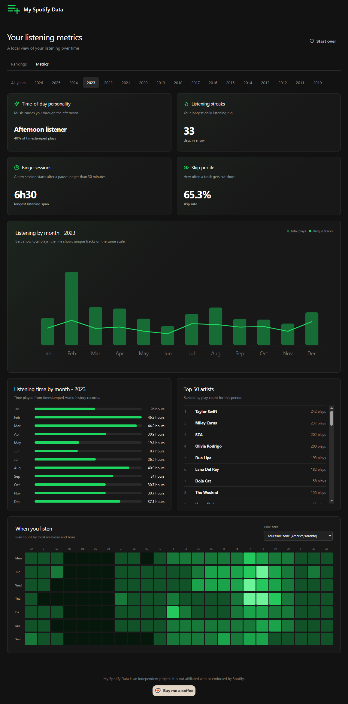
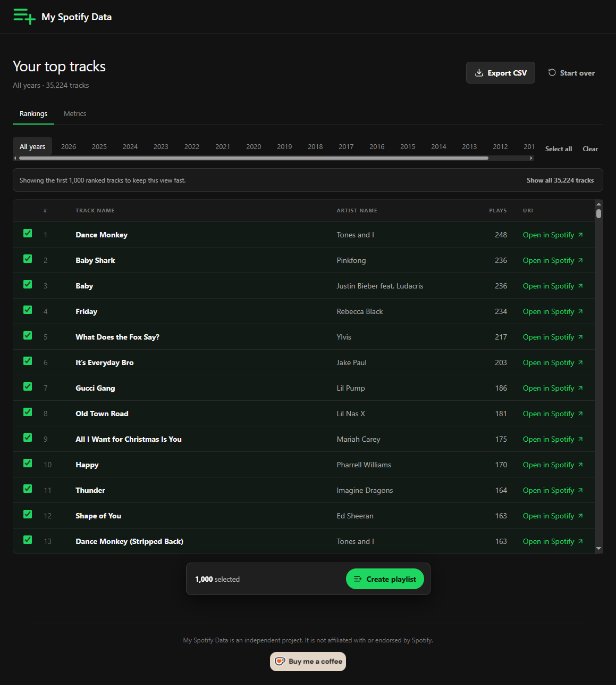
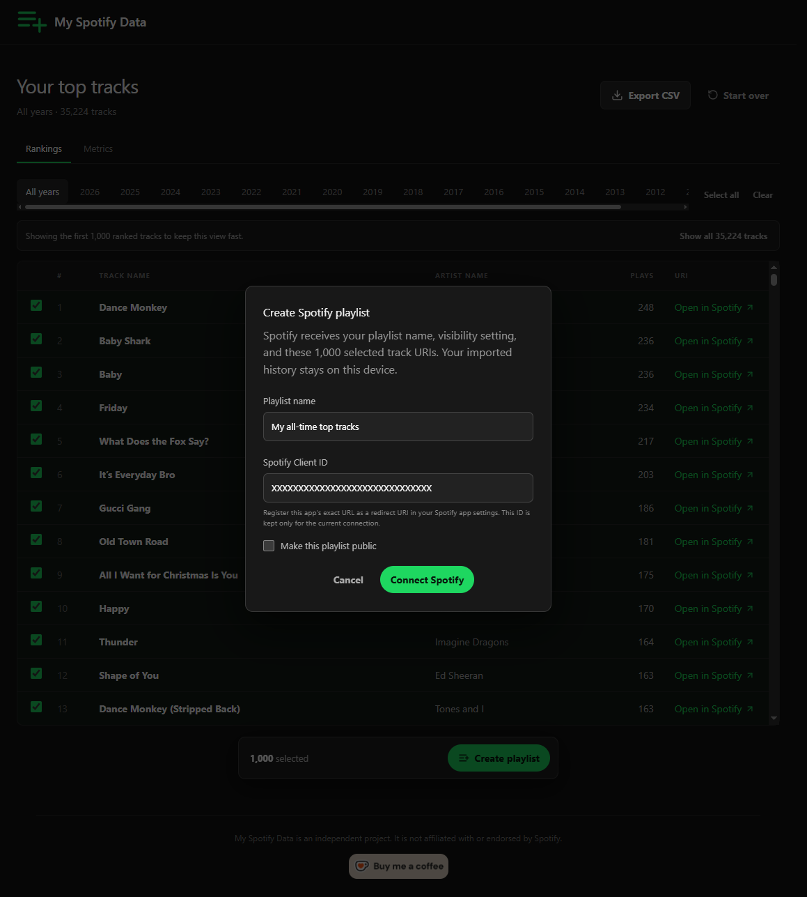

# My Spotify Data

Explore your Spotify Extended Streaming History with private, local analysis. See your top tracks and artists, listening patterns, yearly rankings, and create playlists from selected tracks.

[Open the live web app](https://my-spotify-data-gamma.vercel.app/) · [Download the Android APK](https://github.com/wekxx/my-spotify-data/releases)

> My Spotify Data is an independent project. It is not affiliated with or endorsed by Spotify.

## Features

- Import one Spotify history ZIP or multiple Audio JSON files
- View all-time and yearly track rankings
- Explore listening time, trends, top artists, and a weekday/hour heatmap
- Export rankings as UTF-8 CSV files
- Open tracks in Spotify
- Create public or private Spotify playlists from selected tracks

The Android app has the same features as the web app. This repository contains the web source; the APK is available from GitHub Releases.

## Screenshots

<table width="100%">
  <tr>
    <td width="25%">
      
    </td>
    <td width="25%">
      
    </td>
    <td rowspan="2" width="25%">
      
    </td>
    <td rowspan="2" width="25%">
      
    </td>
  </tr>
  <tr>
    <td width="25%">
	  
    </td>
    <td width="25%">
      
    </td>
  </tr>
</table>

## Privacy

Your listening history is processed on your device. Imported files, listening events, rankings, and CSV exports are not uploaded to an application server.

Playlist creation is optional. After you authorize Spotify, the app sends only the selected track URIs, playlist name, and visibility setting directly to Spotify. Your Client ID and OAuth token stay in the current session and are not saved. The app does not use a client secret.

## Get your Spotify history

Request **Extended streaming history** from Spotify's privacy and data-download area. This is different from the standard account-data download.

The app accepts:

- One complete ZIP archive, up to 200 MB
- One or more files named like `Streaming_History_Audio_2024.json`

Do not mix ZIP and JSON files in one import. The app ignores video history, podcasts, audiobooks, unrelated files, and records without a valid Spotify track URI.

## Use the app

### Web

Open the [live web app](https://my-spotify-data-gamma.vercel.app/). No installation is required.

### Android

Download the APK from [GitHub Releases](https://github.com/wekxx/my-spotify-data/releases), then install it on your Android device.

### Run locally

Requirements: Node.js 20 or newer and npm.

```powershell
npm install
npm run dev
```

Open `http://127.0.0.1:4173/` if your browser does not open automatically. Windows users can also run `Start My Spotify Data.cmd`.

## Spotify playlist setup

You only need Spotify API setup to create playlists. Create a Spotify Developer app, then enter its Client ID in the playlist dialog.

Register the exact redirect URI for the version you use:

| Version | Redirect URI |
| --- | --- |
| Live web app | `https://my-spotify-data-gamma.vercel.app/` |
| Local web app | `http://127.0.0.1:4173/` |
| Android app | `com.myspotifydata.android://callback` |

If you host the web app at another address, register that exact HTTPS URL instead.

The app uses Authorization Code with PKCE. It requests the `playlist-modify-private` and `playlist-modify-public` scopes.

## License

Released under the [MIT License](LICENSE).
